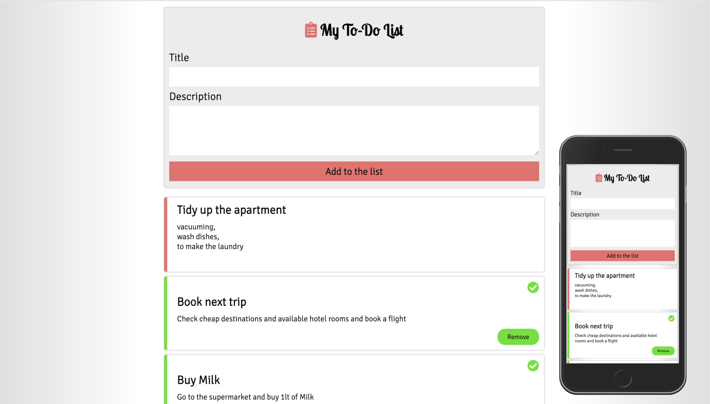

# VanillaJS To-Do List

## Description

This is a simple vanilla JS to-do list, without any frameworks.  
You can enter a title and a description and add it to the "to-do's" below.  
  
By clicking on an active to-do, the item gets marked as done. By clicking on it again, it changes back to active.   
'Done'-items can be removed by clicking on the 'Remove'-Button.  
See screenshot below...  

## Installation

Install all dependencies.  

```bash
npm install
```

## Specifications

- Simple webpack.config already set up
- Linting with Airbnb’s ESlint-configuration
- Storage with localStorage

## Usage

```bash
npm run dev
```

npm run dev is starting the application on localhost:8080

## Preview

|  |
|:---:|
| Preview of the To-Do List |
